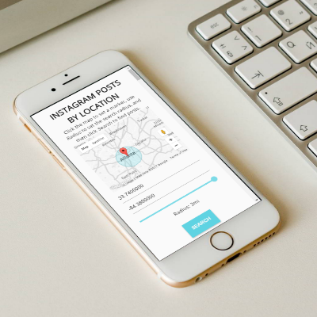

# Instagram Location
Search for posts on *Instagram* based on a location selected via *Google Maps*.

## Heads Up
This is in 'sandbox mode' so only the last 20 posts from each account added to the 'sandbox' will display posts. Not a lot of fun.

## Technologies
* *Google Maps API* as an interactive interface to select the center point of the search radius.
* *Instagram API* to search within the specified radius of the selected coordinates.
* Artisanal, hand-crafted *HTML*, *CSS*, and *JavaScript* with a dash of *jQuery*.

## Imagery
  
